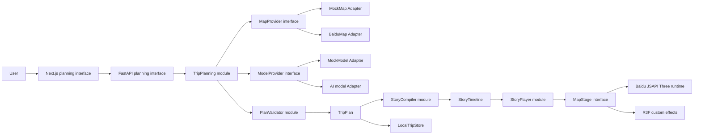

# Lumivo AI Local-First AI Travel Map Design

Date: 2026-08-18

Status: Awaiting written review

Primary reference scenario: Nanjing, China, three days

## 1. Purpose

Lumivo AI is a China-first travel-planning experience where conversation and map animation tell the same story. The user asks for a trip in natural language. The system returns a map-verified itinerary and animates the progression from a globe to a flat map, into the destination city, and along each day's route.

The MVP proves the complete experience locally before any production deployment work. It must be possible to develop and verify the product with a Next.js process on port 3000 and a FastAPI process on port 8000.

## 2. Scope

### 2.1 Included

- Natural-language itinerary requests for destinations in China.
- A complete, verified multi-day itinerary.
- Street-level map browsing, POI selection, and route inspection.
- Globe-to-flat-map and city-focus transitions.
- Route drawing, camera following, attraction narration, and chapter playback controls.
- Revision of an existing plan using a new instruction.
- Local browser persistence of the active plan.
- Explicit progress and recoverable error states.

### 2.2 Excluded

- Destinations outside China.
- Real-time location, turn-by-turn navigation, lane guidance, traffic-aware rerouting, or off-route recovery.
- Login, registration, multi-device sync, shared trips, or cloud history.
- PostgreSQL, Redis, background queues, analytics, payments, or administration.
- Production servers, Nginx, container orchestration, domains, certificates, and release automation.

Excluded items may be considered after the local MVP meets its acceptance criteria. Their future possibility must not add abstractions to the first implementation unless a current mock/real seam already needs them.

## 3. Success criteria

The reference flow begins with “我计划去南京玩三天” and succeeds when:

1. The application returns a three-day plan containing real, provider-verified POIs.
2. Every route leg has provider-sourced geometry, distance, and duration.
3. The visual sequence moves from Earth to China, then Nanjing, then the first POI.
4. The player draws and follows each route and shows narration for the active segment or attraction.
5. The user can pause, resume, replay, and move between chapters.
6. Refreshing the browser restores the most recent valid local plan.
7. An overseas request does not call POI, route, or model planning and displays “暂不支持该地区，等待后续开发”。
8. Invalid model output or unavailable map data is reported as an error and is never converted into a fabricated playable plan.

## 4. Architecture



The architecture separates facts, planning, and presentation:

- Baidu map data is the authority for POIs, coordinates, paths, distances, and durations.
- The AI model interprets intent, chooses among verified candidates, schedules visits, and writes concise narration.
- Pure validation rejects invalid plans before playback.
- StoryCompiler converts a validated plan into deterministic semantic commands.
- StoryPlayer controls time and dispatches commands without knowing provider SDK objects.
- MapStage translates commands into map and R3F behavior.

## 5. Frontend modules

### 5.1 PlanningWorkspace

PlanningWorkspace composes the request form, progress display, day itinerary, MapStage, and StoryPlayer. It owns the active request state and active plan identity but delegates map, playback, persistence, and remote calls to their respective modules.

### 5.2 TripClient

TripClient is the frontend interface to FastAPI:

```ts
interface TripClient {
  plan(request: TripRequest, onProgress: (event: PlanningEvent) => void): Promise<PlanningResult>;
  revise(request: ReviseTripRequest, onProgress: (event: PlanningEvent) => void): Promise<PlanningResult>;
}
```

It is responsible for transport, progress decoding, cancellation, and converting backend errors into the shared error shape. UI modules do not call `fetch` directly.

### 5.3 LocalTripStore

`LocalTripStore` is a focused module with `loadActive`, `saveActive`, and `clearActive` functions backed by `localStorage`. Stored values are parsed and version-checked before use; corrupt data is removed and treated as no active plan.

The MVP does not define a persistence interface because only one implementation exists. When cloud persistence is implemented, a `TripRepository` interface and local/cloud Adapters can replace this module at a real seam.

### 5.4 StoryPlayer

StoryPlayer is a deterministic state machine over a StoryTimeline. Its interface accepts `load({ plan, timeline })`, `play`, `pause`, `seekChapter`, `next`, `previous`, and `replay`. `load` rejects mismatched plan/timeline IDs or versions and prepares MapStage with the plan's POIs and route legs. Its observable state contains status, current chapter, elapsed time, total time, and active narration.

StoryPlayer dispatches semantic commands to MapStage. It never imports Baidu classes, Three.js objects, React components, or model output.

### 5.5 MapStage

MapStage owns the visible map surface and camera. Its `prepare(plan)` operation indexes verified POIs and route legs before playback. It then accepts these commands:

- `globe.focus`
- `projection.toFlat`
- `camera.flyTo`
- `poi.show`
- `route.draw`
- `route.follow`
- `narration.show`
- `chapter.pause`
- `stage.clear`

Each command carries a unique command ID, chapter ID, start time, duration, easing name, and typed payload. Replaying or seeking reconstructs stage state from the start of the selected chapter rather than relying on incidental previous animation state.

JSAPI Three remains authoritative for the basemap, projection, POI hit testing, geographic conversion, and map camera. R3F provides custom Earth, route highlights, particles, markers, and transitions. The integration spike must establish one visible WebGL ownership model and synchronized frame updates. Two competing full-screen render loops are not an acceptable production result.

## 6. Backend modules

### 6.1 TripPlanning

TripPlanning exposes one high-leverage operation for initial planning and one for revision. It orchestrates region validation, POI retrieval, model selection, route retrieval, scheduling validation, narration, and timeline compilation.

The planning order is fixed:

1. Normalize the user request.
2. Reject unsupported regions.
3. Fetch candidate POIs from MapProvider.
4. Ask ModelProvider to choose only from candidate UIDs and propose a schedule.
5. Fetch route legs from MapProvider.
6. Validate identity, coordinates, hours, reachability, and completeness.
7. Generate narration grounded in the validated plan.
8. Produce TripPlan.
9. Compile StoryTimeline from that exact plan version.

Revision receives the current full TripPlan plus the new instruction. It returns a new plan with an incremented version and a newly compiled timeline. It never mutates a stored server-side plan in the MVP.

### 6.2 MapProvider seam

```py
class MapProvider(Protocol):
    async def search_pois(self, query: PoiSearchQuery) -> list[VerifiedPoi]: ...
    async def route(self, request: RouteRequest) -> RouteLeg: ...
```

Two Adapters make this a real seam:

- `MockMapAdapter` returns deterministic Nanjing fixture data for local development and tests.
- `BaiduMapAdapter` calls Baidu POI and route services and converts all results into canonical Pydantic models.

Provider-specific response objects do not escape the Adapter.

### 6.3 ModelProvider seam

```py
class ModelProvider(Protocol):
    async def create_schedule(self, request: SchedulePrompt) -> ProposedSchedule: ...
    async def create_narration(self, request: NarrationPrompt) -> NarrationSet: ...
```

Two Adapters are supported:

- `MockModelAdapter` returns deterministic selections and narration for the Nanjing fixture.
- A real model Adapter returns structured data validated by Pydantic.

The schedule prompt contains verified candidates and instructs the model to return candidate UIDs. The Adapter rejects unknown UIDs and malformed structure before orchestration continues.

### 6.4 PlanValidator

PlanValidator is a pure module. It checks:

- destination is supported and normalized;
- day count matches the request;
- all POI UIDs exist in the verified candidate set;
- all points use BD-09 and fall within valid ranges;
- each consecutive POI pair has one matching route leg;
- route endpoints match their POIs;
- durations and stay times are positive;
- daily timing is feasible when opening hours are known;
- unknown or uncertain opening hours produce warnings;
- the plan contains enough content to play every day.

It returns the validated plan or structured validation errors. It does not repair fabricated locations or routes.

### 6.5 StoryCompiler

StoryCompiler is pure and deterministic. Given the same TripPlan ID and version, it produces the same StoryTimeline. It creates an introduction chapter, globe-to-city transition, one chapter per route leg or attraction group, and a closing chapter. Durations come from explicit compiler rules rather than route travel time, so a one-hour real journey can be represented by a short animation.

## 7. Canonical data contracts

Pydantic models are the source of truth. Frontend TypeScript types are generated or mechanically derived from FastAPI's OpenAPI document.

```ts
type GeoPoint = {
  lng: number;
  lat: number;
  crs: "BD09";
};

type TripRequest = {
  destination: string;
  days: number;
  departure?: string;
  startDate?: string;
  interests?: string[];
  pace?: "relaxed" | "balanced" | "intensive";
  budget?: "economy" | "standard" | "premium";
  transport?: Array<"walk" | "transit" | "drive" | "ride">;
  message: string;
};

type VerifiedPoi = {
  uid: string;
  name: string;
  address: string;
  point: GeoPoint;
  openingHours?: string;
  recommendedStayMinutes: number;
  source: "baidu" | "fixture";
  verifiedAt: string;
};

type TripStop = {
  poi: VerifiedPoi;
  arrivalTime?: string;
  departureTime?: string;
  narration: string;
};

type RouteLeg = {
  id: string;
  fromPoiUid: string;
  toPoiUid: string;
  mode: "walk" | "transit" | "drive" | "ride";
  distanceMeters: number;
  durationSeconds: number;
  geometry: GeoPoint[];
};

type TripDay = {
  day: number;
  title: string;
  summary: string;
  stops: TripStop[];
  routeLegs: RouteLeg[];
};

type PlanWarning = {
  code: "OPENING_HOURS_UNCERTAIN" | "SCHEDULE_TIGHT" | "TRANSPORT_LIMITED";
  message: string;
  poiUid?: string;
};

type TripPlan = {
  id: string;
  version: number;
  destination: string;
  summary: string;
  days: TripDay[];
  warnings: PlanWarning[];
};

type StoryCommandType =
  | "globe.focus"
  | "projection.toFlat"
  | "camera.flyTo"
  | "poi.show"
  | "route.draw"
  | "route.follow"
  | "narration.show"
  | "chapter.pause"
  | "stage.clear";

type StoryCommandPayloads = {
  "globe.focus": { target: GeoPoint };
  "projection.toFlat": Record<string, never>;
  "camera.flyTo": { target: GeoPoint; zoom: number };
  "poi.show": { poiUid: string };
  "route.draw": { routeLegId: string };
  "route.follow": { routeLegId: string };
  "narration.show": { text: string; poiUid?: string };
  "chapter.pause": Record<string, never>;
  "stage.clear": Record<string, never>;
};

type StoryCommand<T extends StoryCommandType = StoryCommandType> = {
  id: string;
  chapterId: string;
  type: T;
  startMs: number;
  durationMs: number;
  easing: "linear" | "easeInOut";
  payload: StoryCommandPayloads[T];
};

type StoryChapter = {
  id: string;
  title: string;
  startMs: number;
  durationMs: number;
  commands: StoryCommand[];
};

type StoryTimeline = {
  tripId: string;
  tripVersion: number;
  durationMs: number;
  chapters: StoryChapter[];
};

type PlanningResult = {
  plan: TripPlan;
  timeline: StoryTimeline;
};
```

All times are ISO 8601 strings with an explicit offset when a date exists. All durations use an explicit unit in their field names. Provider raw payloads may be retained in debug logs during development but are not part of the canonical interface.

## 8. HTTP and progress interfaces

### 8.1 Endpoints

- `POST /api/v1/trips/plan`
  - body: `TripRequest`
  - final result: `{ plan: TripPlan, timeline: StoryTimeline }`
- `POST /api/v1/trips/revise`
  - body: `{ plan: TripPlan, instruction: string }`
  - final result: `{ plan: TripPlan, timeline: StoryTimeline }`
- `GET /api/v1/health`
  - result: local process health and configured Adapter modes without exposing keys

Both POST endpoints return `application/x-ndjson`. Each line is one progress-event envelope. The final `planning.completed` event contains `PlanningResult` in its data field; an error event contains `AppError` and terminates the stream.

### 8.2 Progress events

- `planning.started`
- `destination.validated`
- `pois.found`
- `day.planned`
- `routes.calculated`
- `plan.validated`
- `timeline.ready`
- `planning.completed`

Every event contains `requestId`, `sequence`, `type`, `message`, and optional typed data. Sequences are strictly increasing per request. The UI ignores duplicate or older sequence numbers.

## 9. Error handling

All expected errors use:

```ts
type AppError = {
  code: ErrorCode;
  message: string;
  retryable: boolean;
  details?: Record<string, unknown>;
};
```

Supported MVP codes:

- `UNSUPPORTED_REGION`
- `POI_NOT_FOUND`
- `ROUTE_UNAVAILABLE`
- `MAP_PROVIDER_TIMEOUT`
- `MODEL_PROVIDER_TIMEOUT`
- `MODEL_OUTPUT_INVALID`
- `PLAN_INCOMPLETE`
- `TIMELINE_MISMATCH`
- `REQUEST_CANCELLED`
- `INTERNAL_ERROR`

Transient provider timeouts are retried once with a short bounded delay. Validation errors and unsupported regions are not retried. A partial plan is shown only as non-playable diagnostic content; StoryPlayer never loads it.

## 10. Local configuration

The frontend reads public map configuration from `.env.local`. The backend reads provider keys and Adapter modes from `backend/.env`. Both files are ignored by Git. Example files contain names and safe mock defaults but no real credentials.

The application supports these local modes:

| Mode | Map Adapter | Model Adapter | Purpose |
| --- | --- | --- | --- |
| fixture | MockMap | MockModel | Deterministic UI, playback, and tests |
| map-real | BaiduMap | MockModel | Verify real POIs and routes independently |
| full-real | BaiduMap | Real model | Verify the complete local product flow |

Adapter mode is selected by backend configuration. The browser does not choose providers and never receives backend secrets.

## 11. Testing strategy

### 11.1 Frontend

- Reducer/state-machine tests for StoryPlayer play, pause, seek, replay, and plan-version replacement.
- Compiler fixture tests asserting command order and stable IDs.
- MapStage contract tests using a fake stage Adapter.
- Repository tests for valid, missing, old-version, and corrupt localStorage values.
- Browser end-to-end coverage for the deterministic Nanjing fixture and unsupported overseas destination.
- Visual checks for desktop, narrow mobile viewport, reduced motion, and WebGL fallback messaging.

### 11.2 Backend

- Pydantic contract tests for every request, response, event, and error envelope.
- PlanValidator table tests for unknown POIs, wrong CRS, missing legs, endpoint mismatch, impossible durations, and uncertain opening hours.
- StoryCompiler snapshot tests using the Nanjing fixture.
- TripPlanning tests with MockMap and MockModel Adapters.
- Baidu Adapter contract tests with recorded and sanitized provider responses.
- Real-provider smoke tests kept separate from the default deterministic suite.

### 11.3 Integration evidence

A passing build proves compilation only. The MVP acceptance record separately identifies whether the following were tested: deterministic fixture flow, live Baidu POIs, live Baidu routes, live model output, browser playback, local restore, and overseas rejection.

## 12. Performance and accessibility

- Limit device pixel ratio and effect density on low-power devices.
- Dispose Three.js geometries, materials, textures, handlers, and animation subscriptions when replacing the map stage.
- Cancel stale planning requests and ignore events from superseded request IDs.
- Avoid rerendering the React tree on every animation frame; frame state stays inside the rendering runtime.
- Use semantic controls with keyboard focus and Chinese accessible labels.
- Honor `prefers-reduced-motion` by replacing route following and long camera flights with short state transitions while preserving content.
- If WebGL is unavailable, retain the itinerary and show a clear map-animation-unavailable message.

## 13. Security and privacy

- AI and server-side Baidu credentials stay in backend environment configuration.
- Browser-visible map keys use provider restrictions appropriate to local development and later deployment.
- Logs redact keys, authorization headers, and full free-form user messages by default.
- The MVP stores trip data only in the user's browser and sends it to the local backend for planning; it does not claim cloud retention.
- Model prompts contain only information needed to plan the requested trip.

## 14. Delivery sequence

### Phase 1: deterministic visual story

Create the canonical Nanjing fixture, prove the JSAPI Three/R3F ownership model, and implement deterministic StoryPlayer behavior. The deliverable is a fully playable local story with no live provider dependency.

### Phase 2: local backend contracts

Create FastAPI, Pydantic models, OpenAPI type generation, MockMap, MockModel, PlanValidator, StoryCompiler, and streaming progress. The deliverable is a complete frontend-to-backend fixture flow.

### Phase 3: real map facts

Implement Baidu POI and route Adapters and verify them independently with the mock model. The deliverable is a Nanjing plan whose facts and geometry come from Baidu.

### Phase 4: constrained AI planning

Implement a real Model Adapter, structured output validation, grounded scheduling, and narration. The deliverable is a free-form request that produces a valid playable plan without model-generated map facts.

### Phase 5: revision and hardening

Add plan revision, cancellation, recovery UI, local restore, reduced motion, WebGL fallback, performance profiling, and full acceptance evidence.

Production deployment is a separate project decision after Phase 5. It does not block or shape the local MVP beyond keeping secrets out of source control and maintaining clear process ports.

## 15. External technical references

- Baidu JSAPI Three overview: <https://lbsyun.baidu.com/docs/jsapi?title=jsapithree%2Findex>
- Baidu JSAPI Three Engine: <https://lbsyun.baidu.com/jsapithree/docs/classes/mapvthree.Engine.html>
- Baidu JSAPI Three PathTracker: <https://lbsyun.baidu.com/jsapithree/docs/classes/mapvthree.PathTracker.html>
- Baidu Place API V3: <https://lbsyun.baidu.com/docs/webapi?title=placev3%2Fguide%2Fwebservice-placeapiV3%2FinterfaceDocumentV3>
- Baidu Direction API: <https://lbsyun.baidu.com/docs/webapi?title=directionv2%2Fwebservice-direction%2Fdirve>
- React Three Fiber Canvas: <https://r3f.docs.pmnd.rs/api/canvas>
- React Three Fiber render loop: <https://r3f.docs.pmnd.rs/api/hooks>
- FastAPI features: <https://fastapi.tiangolo.com/features/>
- FastAPI streaming responses: <https://fastapi.tiangolo.com/advanced/stream-data/>

## 16. Review decisions captured by this specification

- The MVP is China-only.
- Python is the backend language.
- Login is designed out of the MVP, not partially implemented.
- R3F is retained for custom animation, while Baidu remains the map authority.
- Deployment work begins only after the local experience is substantially complete.
- Mock Adapters are first-class development tools, not temporary untyped data embedded in UI modules.
